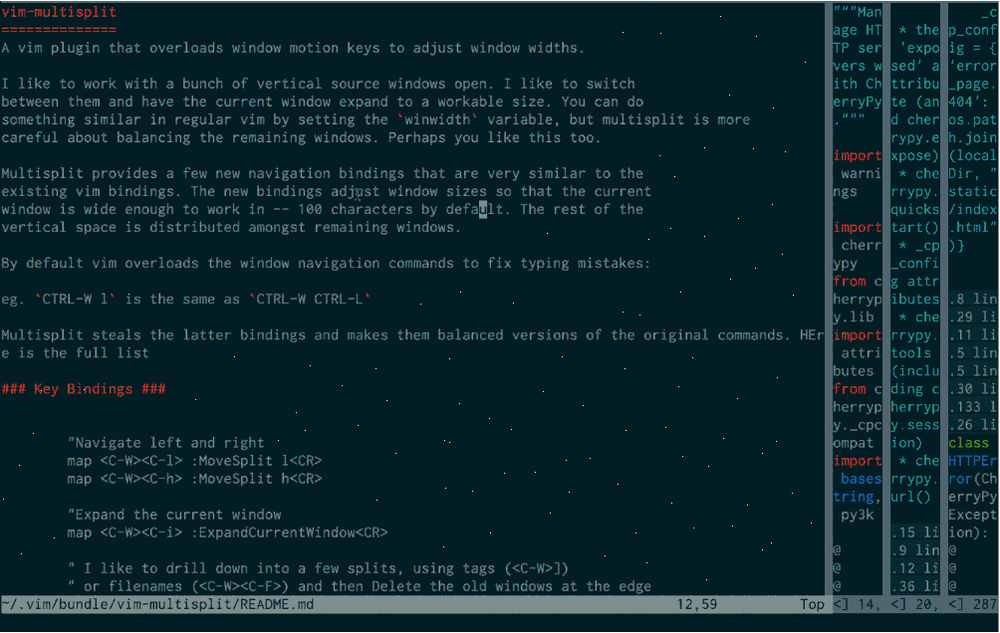

vim-multisplit
==============
A vim plugin that overloads window motion keys to adjust window widths.

I like to work with a bunch of vertical source windows open. I like to switch
between them and have the current window expand to a workable size. You can do
something similar in regular vim by setting the `winwidth` variable, but multisplit is more
careful about balancing the remaining windows. Perhaps you like this too.

Multisplit provides a few new navigation bindings that are very similar to the
existing vim bindings. The new bindings adjust window sizes so that the current
window is wide enough to work in -- 100 characters by default. The rest of the
vertical space is distributed amongst remaining windows.

By default vim overloads the window navigation commands to fix typing mistakes:   

eg. `CTRL-W l` is the same as `CTRL-W CTRL-L`   

Multisplit steals the latter bindings and makes them balanced versions of the original commands. HEre is the full list

### Key Bindings ###

	"Navigate left and right
	map <C-W><C-l> :MoveSplit l<CR>
	map <C-W><C-h> :MoveSplit h<CR>

	"Expand the current window
	map <C-W><C-i> :ExpandCurrentWindow<CR>

	" I like to drill down into a few splits, using tags (<C-W>]) 
	" or filenames (<C-W><C-F>) and then Delete the old windows at the edge
	map <C-W><C-b> :DeleteLeftmost<CR> 
	map <C-W><C-m> :DeleteRightmost<CR>

	map <C-W><C-n> :CreateSplit<CR>

### Notes ###

I tested multisplit on vim 7.3, mac and windows, console and gui
